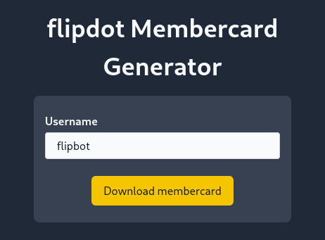
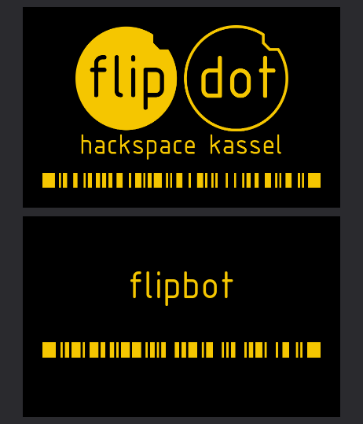

# 🪪 flipdot Membercard Generator

Get your flipdot membercard now! 🔥

It includes your member code so that you can buy drinks the cool way 😎
And it shows the flipdot's Payback code so all your thrift shopping makes the next barbecue happen! 🤘

## Usage

1. Put in your username into this form:

    

2. Get your membercard as PDF:

    

## Development

Make sure to install the dependencies:

```bash
# install the dependencies
pnpm install

# start the development server
pnpm run dev

# build for production
pnpm run build

# locally preview production build
pnpm run preview
```

## Deployment

Check out the [deployment documentation](https://nuxt.com/docs/getting-started/deployment) for more information.
